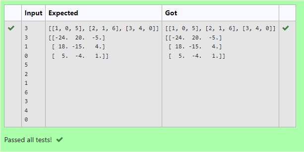

# Inverse-of-matrix

## AIM:
To write a python program to find the inverse of a matrix.

## ALGORITHM:
### Step 1:
Import Numpy module as np.
### Step 2:
Create empty lists.
### Step 3:
Get input from the user for number of rows and columns.
### Step 4:
Use nested lists to append list.
### Step 5:
Print the inverse of the array using np.linalg.inv


## PROGRAM:
```python
#To write a python program to find the inverse of a matrix.
#Developed by: Yogeshvar.M
#Register Number:22003358

import numpy as np
r,c = int(input()),int(input())
l1 = []
l2 = []
for i in range(r):
    for j in range(c):
        num = l1.append(int(input()))
    l2.append(l1)
    l1 = []
print(l2)
array1 = np.array(l2)
arrayinverse = np.linalg.inv(array1)
print(arrayinverse)
```

## OUTPUT:

)

## RESULT:
Thus a program is written to find the inverse of the matrix.
